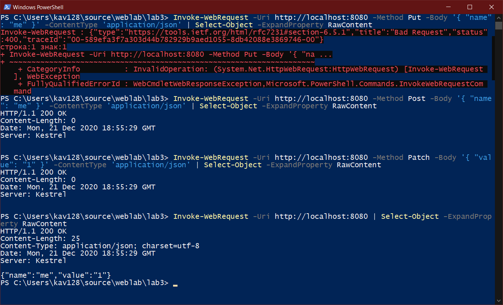

# Лабораторная работа №3

Работа выполнена на языке C# на платформе .NET 5.

## Запуск приложения, используя Docker

Для запуска контейнера необходимо наличие Docker.

- Выполняем сборку контейнера: `docker build -t lab3.`
- Выполняем запуск контейнера: `docker run --rm -p 8080:80 --name lab3 lab3`

Приложение будет доступно по адресу: [http://localhost:8080](http://localhost:8080)

## Запуск приложения, используя dotnet runtime

Для запуска из исходного кода необходимо наличие .NET SDK v5.0.100 или выше. Загрузить можно [тут](https://dotnet.microsoft.com/download/dotnet/5.0).

Запуск осуществляется командой `dotnet run`, выполняемой в корне проекта.

Приложение будет слушать входящие соединения по адресу: [http://localhost:5000](http://localhost:5000).

## Работа с приложением

Приложение принимает REST запросы, отправляемые в корневой путь.

Ниже приложен скриншот работоспособности:

